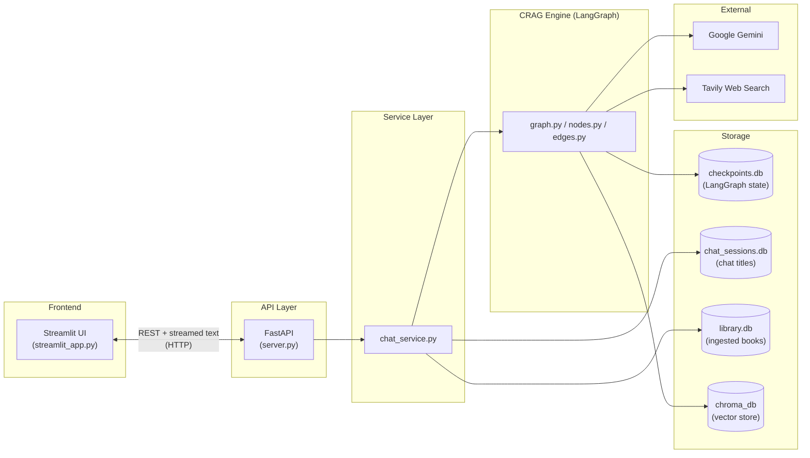
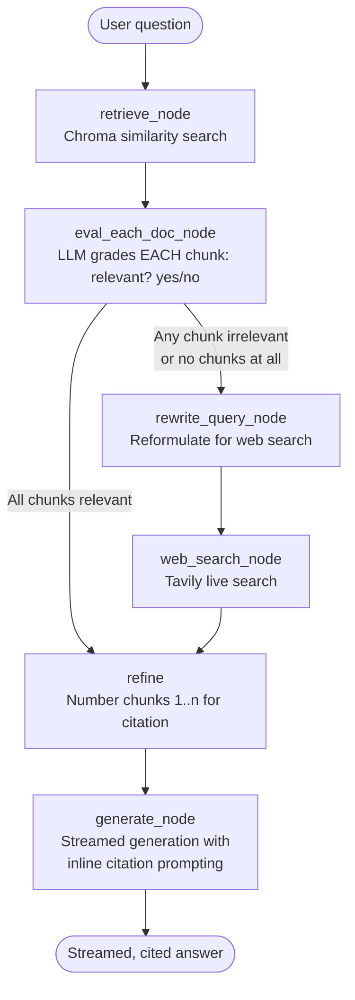

# 🏛️ Philosophical CRAG Assistant

**A Corrective RAG (CRAG) chatbot that answers philosophical questions from your own book library — grounded in real text, falling back to live web search when the library falls short, and citing every claim it makes.**

Built with LangGraph, Google Gemini, ChromaDB, and a decoupled FastAPI + Streamlit architecture.

---

## Why this project exists

Most "RAG chatbot" tutorials retrieve a handful of chunks, stuff them into a prompt, and hope for the best. That breaks down the moment the retrieved chunks are irrelevant — the model either hallucinates or confidently answers from the wrong context. I wanted to build something closer to how a careful researcher actually works: **check whether your sources are actually relevant before trusting them, and go looking elsewhere if they're not.**

That's the core idea behind [Corrective RAG (CRAG)](https://arxiv.org/abs/2401.15884), and this project is a full implementation of that idea as a working philosophy tutor — one that will tell you outright when its library doesn't cover something, rather than making it up.

## What it actually does

Ask it something like *"Why does the old man in* The Old Man and the Sea *describe the sea as feminine?"* and it will:

1. Retrieve the most relevant chunks from your ingested books (local vector search).
2. **Grade every single retrieved chunk for relevance** using the LLM as a judge — not just take the top-k and hope.
3. If the retrieved context is weak or empty, **automatically rewrite the query and fall back to a live web search** to fill the gap.
4. Generate a deep, multi-paragraph answer — streamed token-by-token — that **cites its sources inline** (`[1]`, `[2]`...) so you can verify every claim against the original text.
5. Remember the conversation across sessions (SQLite-backed), let you run multiple parallel chats, rename them, and delete them — all from a sidebar.

## Demo

> *(Add a GIF or screenshots here — e.g. a streaming answer with visible `[1][2]` citations and the expandable source panel below it. This is the single highest-impact thing you can add to this README.)*

---

## Architecture

The system is split into four clean layers, each with a single responsibility — this was a deliberate choice, not an accident of how the project evolved (more on that below):



**Frontend and backend are fully decoupled** — `streamlit_app.py` only ever talks to `server.py` over HTTP (`requests`), never touching LangChain/LangGraph directly. This means the Streamlit UI could be swapped for a React app, a CLI, or a Slack bot without touching a single line of the RAG logic.

### The CRAG pipeline itself

This is the core of the project — a LangGraph state machine, not a linear chain:



Every node is a plain Python function operating on a shared, typed `State` object (`state.py`) — LangGraph handles the routing, retries, and checkpointing around it. The conditional edge (`edges.py`) is where the "corrective" behavior actually lives: it's a single decision point that decides whether the local library was good enough, or whether the system needs to go get better information before answering at all.

---

## Key engineering decisions (and why)

A README that just lists features doesn't show engineering judgment. Here's the reasoning behind the choices that matter:

| Decision | Why |
|---|---|
| **Service layer (`chat_service.py`) separate from API layer (`server.py`)** | The RAG/LangGraph logic doesn't know FastAPI exists. It can be unit-tested directly — call `stream_answer()`, `get_sources()` — with no HTTP mocking. If I swap frontends or add a new client, only a thin adapter changes; the core engine doesn't. |
| **`SqliteSaver` / `AsyncSqliteSaver` instead of `MemorySaver`** | LangGraph's default `MemorySaver` loses all conversation state on process restart. Backing it with SQLite means chats survive a server restart — a small change with a big reliability payoff. |
| **Per-document relevance grading, not just top-k retrieval** | Vector similarity ≠ relevance. A chunk can be the *closest* match and still not actually answer the question. Grading every chunk with the LLM before trusting it is what makes this "corrective" rather than "naive" RAG. |
| **Local HuggingFace embeddings (`all-MiniLM-L6-v2`) instead of an embedding API** | No per-query embedding cost, works offline once downloaded, and keeps ingestion fast for a personal library. Trade-off: lower embedding quality than a hosted model like `text-embedding-004` — acceptable here since the CRAG grading step catches poor retrievals downstream. |
| **Token-level streaming scoped to a single graph node** | The CRAG pipeline calls the LLM multiple times internally (grading, query rewriting, generation). Naively streaming the whole graph would leak the grader's "yes/no" chatter into the UI. Filtering `stream_mode="messages"` events by `metadata["langgraph_node"] == "generate"` means only the final answer is ever shown live. |
| **Numbered-context citation scheme (`[1]`, `[2]`...)** | Rather than trusting the model to cite sources accurately from memory, the context itself is pre-numbered before it reaches the prompt, and the model is instructed to cite *only* those numbers. The UI then maps each number back to the exact source chunk (file + page, or URL) in an expandable panel — so every citation is independently verifiable, not just a plausible-looking annotation. |
| **A separate `library_store.py` tracking ingested filenames** | Chroma doesn't make "have I already ingested this?" a cheap question to answer. A small side-table avoids duplicate chunks silently piling up in the vector store on re-upload, and lets the UI show what's already in the library after a restart. |

---

## Tech stack

| Layer | Technology |
|---|---|
| Orchestration | [LangGraph](https://langchain-ai.github.io/langgraph/) (stateful graph, not a linear chain) |
| LLM | Google Gemini (via `langchain-google-genai`) |
| Embeddings | HuggingFace `all-MiniLM-L6-v2` (local, offline) |
| Vector store | ChromaDB (persistent, on-disk) |
| Web search fallback | Tavily |
| Conversation persistence | LangGraph `SqliteSaver` / `AsyncSqliteSaver` |
| Chat metadata + library tracking | Raw SQLite (`chat_store.py`, `library_store.py`) |
| Backend API | FastAPI (streaming responses via `StreamingResponse`) |
| Frontend | Streamlit |
| Document parsing | `PyPDFLoader` / `TextLoader` + `RecursiveCharacterTextSplitter` |

---

## Features

- 🧠 **Corrective RAG** — grades retrieved context before trusting it; falls back to live web search automatically when the library is insufficient.
- 📖 **Verifiable citations** — every answer cites `[1]`, `[2]`... inline, with an expandable panel showing the exact source text and location (file/page or URL) for each.
- ⚡ **True token streaming** — answers appear live, not all at once, scoped precisely to the generation step (no internal LLM "chatter" leaks into the UI).
- 💬 **Multi-chat sessions** — create, rename, switch between, and delete independent conversations, each with its own persistent history.
- 💾 **Durable persistence** — conversation state, chat metadata, and the ingested-book list all survive a full server restart (SQLite-backed).
- 📚 **Library management** — upload PDFs/TXTs to expand the knowledge base from the sidebar; duplicate uploads are detected and skipped rather than silently re-ingested.
- 🧩 **Decoupled architecture** — Streamlit frontend, FastAPI backend, and a framework-agnostic service layer, each independently testable and replaceable.

---

## Project structure

```
.
├── streamlit_app.py     # Frontend — pure UI, talks to server.py only over HTTP
├── server.py            # FastAPI backend — routing, schemas, streaming responses
├── chat_service.py       # Service layer — the ONLY module that touches LangGraph directly
├── graph.py              # Compiles the CRAG StateGraph, wires up the checkpointer
├── nodes.py               # Each CRAG step: retrieve, grade, rewrite, web search, refine, generate
├── edges.py               # The conditional routing logic ("corrective" decision point)
├── state.py               # Shared, typed state passed between graph nodes
├── config.py              # LLM, embeddings, retriever, prompt, and web search tool setup
├── ingest.py              # PDF/TXT loading, chunking, and Chroma ingestion
├── chat_store.py          # SQLite: chat titles / session metadata
├── library_store.py       # SQLite: tracks which books have been ingested
├── main.py                # Optional CLI entry point (bypasses the web UI entirely)
├── chroma_db/             # Persistent vector store (generated)
├── checkpoints/           # LangGraph conversation state (generated)
├── chat_sessions.db       # Chat metadata (generated)
└── library.db             # Ingested-book tracking (generated)
```

---

## Getting started

### 1. Prerequisites

- Python 3.10+
- A [Google AI Studio API key](https://aistudio.google.com/) (for Gemini)
- A [Tavily API key](https://tavily.com/) (for the web search fallback — free tier is enough)

### 2. Installation

```bash
git clone https://github.com/<your-username>/philosophical-crag-assistant.git
cd philosophical-crag-assistant
pip install -r requirements.txt
```

### 3. Environment variables

Create a `.env` file in the project root:

```env
GOOGLE_API_KEY=your_google_api_key_here
TAVILY_API_KEY=your_tavily_api_key_here
```

### 4. Run it

This project runs as two separate processes — a real client/server split, not a monolith:

```bash
# Terminal 1 — the FastAPI backend
uvicorn server:server --reload

# Terminal 2 — the Streamlit frontend
streamlit run streamlit_app.py
```

Open the Streamlit URL it prints (usually `http://localhost:8501`), upload a PDF or TXT from the sidebar, and start asking questions.

You can also inspect the API directly at `http://127.0.0.1:8000/docs` (FastAPI's auto-generated Swagger UI) — useful for testing endpoints independently of the UI, or for wiring up a different frontend entirely.

---

## Known limitations

Being upfront about these is deliberate — they're the honest trade-offs of a project built solo, not oversights I'm unaware of:

- **No conversation summarization or truncation.** Full chat history is sent to the LLM on every turn (see `state.py`'s `add_messages` reducer). Long conversations will eventually hit context-length or cost limits — a sliding window or summarization step is the natural next addition.
- **Single embedding model, no re-ranking.** Retrieval quality is bounded by `all-MiniLM-L6-v2`; a cross-encoder re-ranking step after retrieval would likely improve precision further.
- **No authentication.** This is a single-user local tool by design — chats aren't scoped to individual users.
- **Best-effort checkpoint cleanup.** Deleting a chat removes its metadata immediately; clearing its underlying LangGraph checkpoint depends on the installed `langgraph-checkpoint-sqlite` version supporting `delete_thread()`.

## Roadmap

- [ ] Cross-encoder re-ranking after initial retrieval
- [ ] Conversation summarization for long-running chats
- [ ] Multi-user auth + per-user chat isolation
- [ ] Swap Streamlit for a React frontend against the existing FastAPI backend (no backend changes needed)
- [ ] Docker Compose setup for one-command local deployment

---

## Author

Built by **Arjun Verma**

- GitHub: [github.com/arjunverma2004](https://github.com/arjunverma2004)
- Hugging Face: [huggingface.co/arjunverma2004](https://huggingface.co/arjunverma2004)